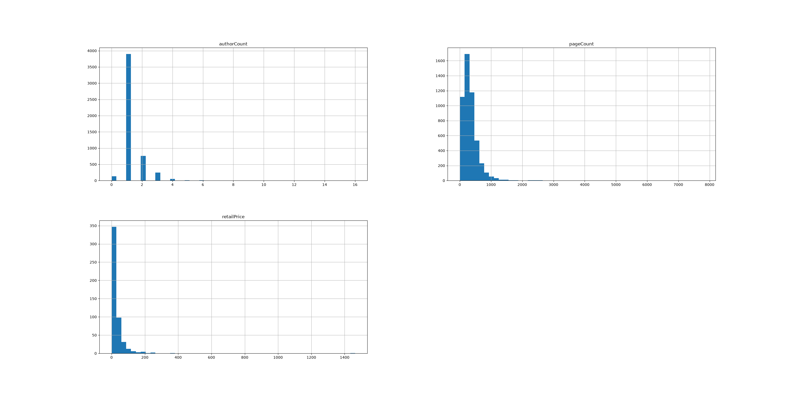
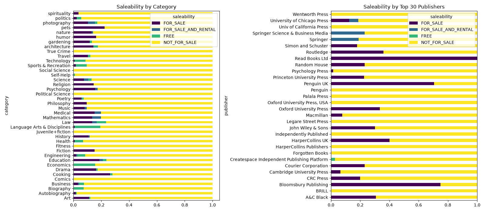
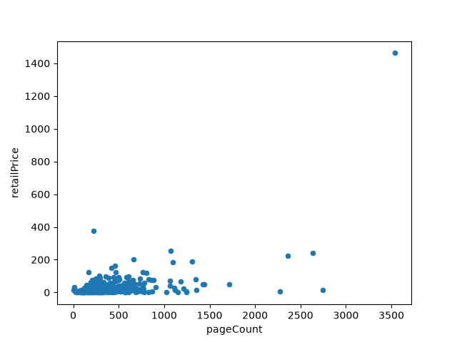

# Random Forest Classification: Book Saleability Prediction Pipeline

## 📝 Introduction

An end-to-end Machine Learning pipeline that predicts whether a book is **saleable** (free, paid, or not-for-sale) based on metadata extracted via the Google Books API. Built with Python, Scikit-Learn, and Pandas, following modular, production-ready ML engineering practices.

---

## 📌 Project Overview

Publishers and book distributors need data-driven insights into pricing and market distribution strategies. This project automates the workflow from raw REST API data ingestion to hyperparameter-tuned classification models bundled into a persistent serialization pipeline (`joblib`).

### Key Highlights
* **Automated Data Pipeline:** Ingests and merges raw JSON metadata into structured datasets with deduplication.
* **Custom Scikit-Learn Transformers:** Implements modular feature engineering (handling high-cardinality publishers and publication date extraction).
* **Leakage-Free Preprocessing:** Standardized pipeline utilizing `ColumnTransformer` for numerical imputation/scaling and categorical encoding.
* **Model Evaluation & Persistence:** Random Forest model tuned via 5-fold `GridSearchCV` and packaged into a deployable end-to-end pipeline artifact.

---

## 📊 Exploratory Data Analysis & Insights

| Feature Distribution | Saleability vs Category and Publishers | Page Count vs Saleability |
| :---: | :---: | :---: |
|  |  |  |
| *Distribution of numerical attributes (page count, author count, publish year)* | *Maturity distribution across primary book categories* | *Correlation between book length and saleability status* |

---

## 🛠️ Architecture & Workflow

```text
Raw API Data ──> Ingestion & Normalization ──> Custom Transformers ──> ColumnTransformer ──> GridSearchCV (RandomForest) ──> Serialized Pipeline (.pkl)
```

**Ingestion Layer:** Extracts book metadata from the Google Books API into structured CSV tables (books_data_1.csv, books_data_2.csv).

**Preprocessing Layer:**

- Numerical Features (pageCount, authorCount, publishYear): Handled via SimpleImputer(strategy="median") and StandardScaler().
- High-Cardinality Categoricals (publisher): Filtered via custom TopPublishersEncoder to keep the top N publishers and group rare entries into "Other", followed by constant imputation and OrdinalEncoder.
- Categorical Features (category, maturityRating): Encoded using OrdinalEncoder.

**Modeling Layer:** RandomForestClassifier optimized via GridSearchCV cross-validation.

**Artifact Persistence:** The complete preprocessing and model pipeline is saved as models/book_saleability_rf_v1.pkl for one-call inference (pipeline.predict(raw_data)).

---

## 📁 Repository Structure

```
dtree-books/
│
├── data/
│   ├── books_data_1.csv              # Raw book metadata (Part 1)
│   └── books_data_2.csv              # Raw book metadata (Part 2)
│
├── images/
│   ├── crosstab_plots.png            # EDA: Categorical cross-tabulations
│   ├── histogram_plots.png           # EDA: Feature distributions
│   └── scatter_plot.png              # EDA: Numeric bivariate analysis
│
├── models/
│   └── book_saleability_rf_v1.pkl    # Serialized end-to-end ML pipeline
│
├── notebooks/
│   ├── data_ingestion.ipynb          # API harvesting and data cleaning
│   └── data_training.ipynb           # EDA, pipeline definition, tuning, & evaluation
│
├── src/
│   ├── __init__.py
│   └── transformers.py               # Custom Scikit-Learn transformers
│
└── README.md
```

---

## 🚀 Quickstart & Installation

### 1. Clone the Repository

```bash
git clone [https://github.com/your-username/dtree-books.git](https://github.com/your-username/dtree-books.git)
cd dtree-books
```

### 2. Create and Activate Virtual Environment

```bash
# Windows
python -m venv venv
venv\\Scripts\\activate

# macOS / Linux
python3 -m venv venv
source venv/bin/activate
```

### 3. Install Dependencies

```bash
pip install numpy pandas scikit-learn matplotlib seaborn joblib jupyter
```

---

## 💻 Running Inference

To see the complete end-to-end workflow and results, run the [data_training.ipynb](notebooks/data_training.ipynb) notebook. It includes exploratory data analysis, model training, hyperparameter tuning, and evaluation metrics.

If you wish to make predictions on new data after running the notebook, you can add the following code snippet in a new cell at the bottom of the notebook and play around with the variables:

```python
import joblib
import pandas as pd
from pathlib import Path
from src.transformers import TopPublishersEncoder

# 1. Resolve path to project root, then down into models/
ROOT_DIR = Path.cwd().parent
MODEL_PATH = ROOT_DIR / "models" / "book_saleability_rf_v1.pkl"

# 2. Load the trained pipeline
model_pipeline = joblib.load(MODEL_PATH)

# 3. Sample raw book data
sample_books = pd.DataFrame([
    {
        "publishYear": 2021,
        "authorCount": 2,
        "pageCount": 384,
        "publisher": "Penguin Books",
        "category": "Fiction",
        "maturityRating": "NOT_MATURE"
    }
])

# 4. Predict saleability
predictions = model_pipeline.predict(sample_books)
print("Saleability Prediction:", predictions[0])

```

---

## 📈 Tech Stack

- **Language:** Python 3.10+
- **Data Manipulation & Analysis:** Pandas, NumPy
- **Machine Learning:** Scikit-Learn (Pipeline, ColumnTransformer, GridSearchCV, RandomForestClassifier)
- **Visualization:** Matplotlib, Seaborn
- **Model Serialization:** Joblib
